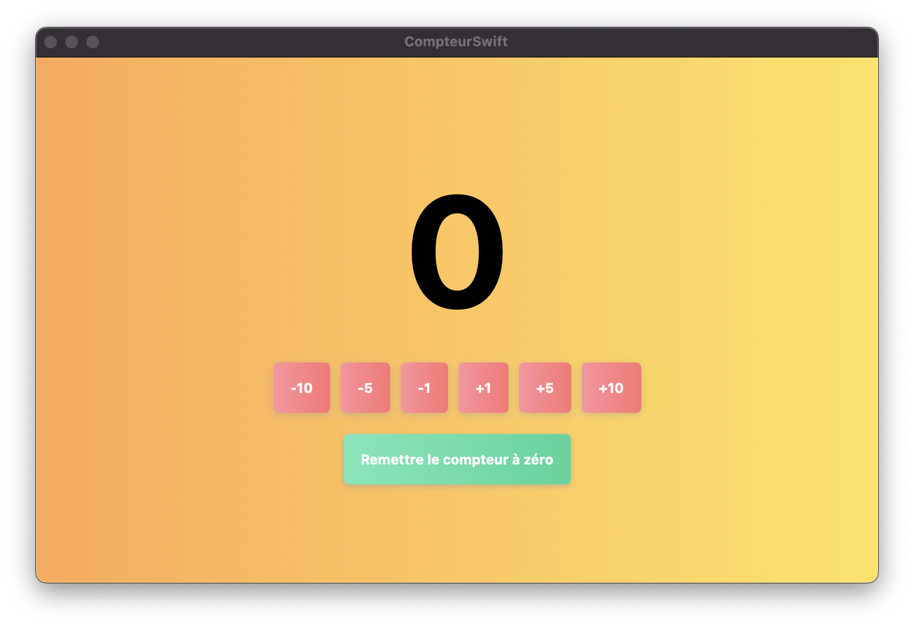

# CompteurSwiftUI

## Overview

CompteurSwiftUI is a versatile counter app built with SwiftUI that allows users to increment or decrement a value with simple taps. Designed with usability in mind, it offers a clear visual and interactive interface for both casual and power users. The app is fully adaptive, providing a seamless experience on iPhone, iPad, and Mac.

## Features

- Simple and intuitive interface.
- Customizable counter increment/decrement values.
- Beautiful gradient backgrounds and animations.
- Adaptive layout for various device screens.

## Screenshots

### iPhone


### iPad


### Mac


## Installation

To run CompteurSwiftUI on your device, clone the repository, open the project in Xcode, and run it on your chosen simulator or physical device.

```bash
git clone https://github.com/your-username/CompteurSwiftUI.git
```

## Usage

Open the app and tap on the plus and minus buttons to adjust the counter as needed. To reset the counter to zero, press the reset button.

## Contributing

Contributions to the CompteurSwiftUI project are welcome! Please consider forking the repository and submitting a pull request.
